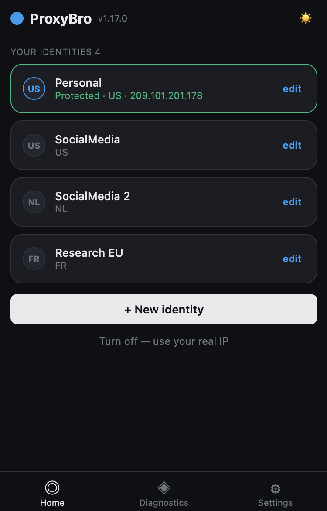
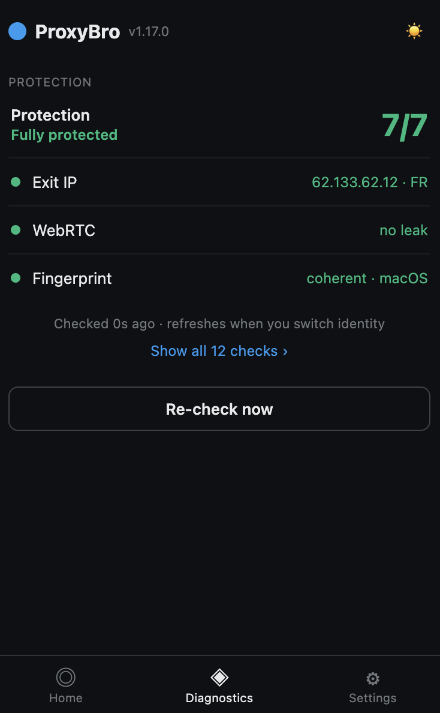
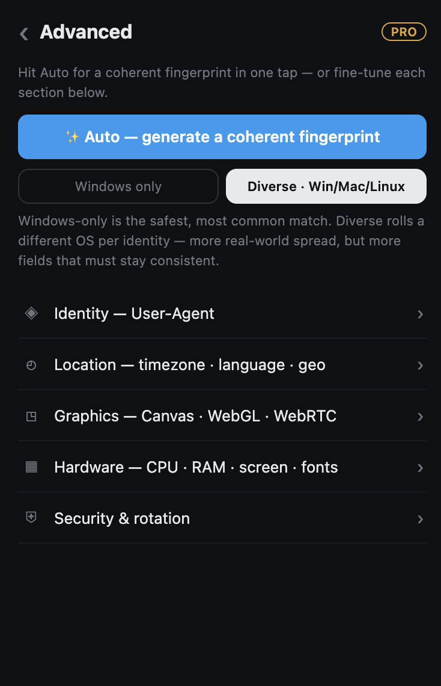
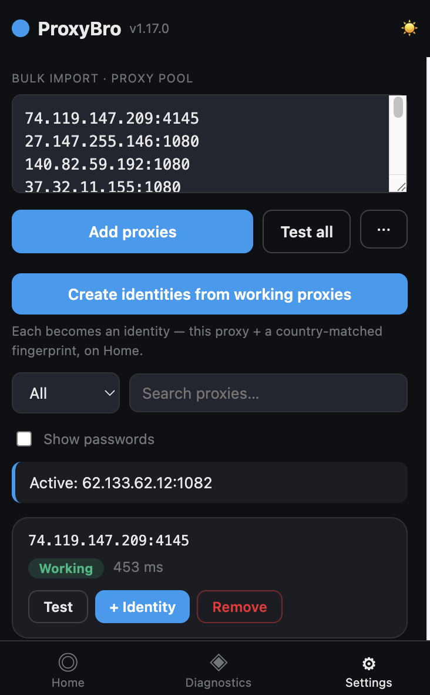
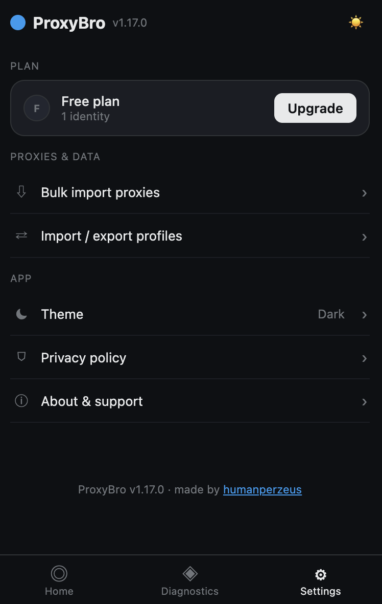

# ProxyBro

### One identity per account. Never linked.

A Chrome (MV3) proxy manager that pairs every proxy with a coherent, **country‑matched** privacy fingerprint — so each account looks like its own real device, not a row in your spreadsheet.

[**→ Add to Chrome**](https://chromewebstore.google.com/detail/ceobadpmhnfmlndkcmobhejkmbjimmcj) · [proxybro.app](https://proxybro.app) · [Report an issue](../../issues)

 

  

**▶ Watch the demo**

---

## What it does

ProxyBro turns a list of proxies into **identities**. Each identity is a saved profile with its own proxy, a matching country‑correct fingerprint, and WebRTC leak protection. Tap an identity and everything applies together — so the accounts you keep apart actually *stay* apart.

> **Honest by design.** A browser extension shares one browser's cookies, so ProxyBro is built for **sequential, one‑account‑at‑a‑time** use: it switches the proxy + fingerprint (and can clear cookies on switch). It does **not** pretend to give simultaneous isolation like a full anti‑detect browser. This is a **privacy** tool, not a ban‑evasion promise.

## Screens

<table>
  <tr>
    <td align="center"> <b>Diagnostics</b></td>
    <td align="center"> <b>Advanced fingerprint</b></td>
    <td align="center"> <b>Bulk import</b></td>
    <td align="center"> <b>Settings</b></td>
  </tr>
</table>

## Features

**Identities**
- One proxy + one coherent fingerprint per account — saved, one‑tap switchable
- Auto‑generated **country‑matched** fingerprint: user‑agent, platform, Client Hints, WebGL, canvas, timezone and language all stay consistent with the exit IP
- **Windows‑only** or **Diverse (Win / Mac / Linux)** mode — every identity gets a unique device profile and canvas seed, so two accounts never share a fingerprint
- **Any‑format bulk import** — paste `host:port`, `user:pass@host:port`, `type:ip:port:user:pass`, or comma/space/tab‑separated lists; ProxyBro auto‑detects the layout, no fixed order needed
- **Proxy type picker** — HTTP / HTTPS / SOCKS5 / SOCKS4 per identity; turn the working proxies straight into identities

**Protection**
- WebRTC leak protection — stops your real IP leaking over WebRTC
- **DNS‑leak hardening** — disables DNS prefetch while proxied and forces DoH for SOCKS4, so DNS stops leaking to your local ISP (HTTP/SOCKS5 resolve DNS through the proxy = exit‑country resolver)
- Coherent spoofing that avoids the contradictions detection actually looks for
- In‑app **Diagnostics**: exit IP, WebRTC, and fingerprint coherence — a plain‑language verdict plus an expandable expert breakdown

**Free & Pro**
- **Free:** 1 identity
- **Pro:** unlimited identities + the advanced per‑field fingerprint editor — **$5/mo** or **$30/yr**, via Creem (license key, validated server‑side; the secret never ships in the extension)

## Install

**[Chrome Web Store](https://chromewebstore.google.com/detail/ceobadpmhnfmlndkcmobhejkmbjimmcj)** — the easy way (auto‑updates).

**Unpacked (developer / any Chromium browser):**
1. Download [`proxybro.zip`](../../releases/latest) (or clone this repo) and unzip
2. Open `chrome://extensions` and enable **Developer mode**
3. Click **Load unpacked** and select the folder
4. Open ProxyBro's **Details** and turn on **“Allow user scripts”** — required so your fingerprint applies before any page script runs (leak‑proof). ProxyBro shows a one‑tap setup card for this.
5. Pin the **ProxyBro** icon to your toolbar

## How it works

1. **Add proxies** — Settings → *Bulk import*, paste `host:port:user:pass` (one per line)
2. **Make identities** — convert working proxies into identities, or hit **+ New identity**; each gets a coherent country‑matched fingerprint automatically
3. **Switch** — tap an identity on Home; its proxy, fingerprint and leak protection apply together
4. **Verify** — the **Diagnostics** tab confirms the exit IP, no WebRTC leak, and a coherent fingerprint

## Permissions — and why

| Permission | Why |
|---|---|
| `proxy` | set the active proxy |
| `storage` | save identities and settings on your device |
| `webRequest`, `webRequestAuthProvider` | authenticate to proxies that need it |
| `privacy` | apply the WebRTC leak‑protection policy |
| `userScripts` | inject your fingerprint at **document_start**, before any page script — so the real one never leaks (uses the one‑time “Allow user scripts” toggle) |
| `scripting`, `webNavigation` | update the fingerprint on already‑open tabs |
| `declarativeNetRequest` | request blocking |
| `tabs`, `cookies`, `notifications` | switch context, optional cookie clear, status |

## Privacy

Identities and proxies live in Chrome's extension‑local storage **on your device** — they are never uploaded. The only network call ProxyBro makes for itself is license validation, which sends just your license key to the ProxyBro worker. Full policy: [proxybro.app/#privacy](https://proxybro.app/#privacy).

## Links

- **Website:** [proxybro.app](https://proxybro.app)
- **Maker:** [@humanperzeus](https://x.com/humanperzeus)

## License

MIT — see [LICENCE](LICENCE).

## Disclaimer

Provided "as is", without warranty. You are responsible for using proxies in line with applicable laws and the terms of the sites you visit.
