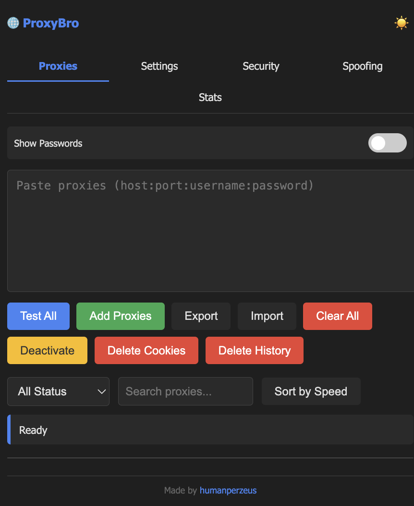

# ProxyBro - Chrome extension Proxy Manager with Security Features

If you find ProxyBro useful, consider following me on social media for updates, tips, and other projects:

- **X (Twitter)**: Follow [@humanperzeus](https://x.com/humanperzeus) for quick updates and tech tips
- **YouTube**: Subscribe to my channel for tutorials, extension guides, and privacy tips (coming soon!)

ProxyBro is a powerful Chrome extension that provides advanced proxy management capabilities with comprehensive security and privacy features. It allows users to manage multiple proxies, test their performance, rotate between them automatically, and protect their online identity through various spoofing techniques.

## Features

### Proxy Management
- **Add Multiple Proxies**: Easily import and manage multiple proxy servers
- **Proxy Testing**: Test proxy connectivity, speed, and location
- **Automatic Rotation**: Configure automatic proxy rotation with customizable intervals
- **Proxy Statistics**: Track proxy performance and usage statistics
- **Import/Export**: Backup and restore your proxy configurations

### Security Features
- **WebRTC Leak Protection**: Prevents IP leaks through WebRTC
- **Kill Switch**: Automatically blocks all traffic if proxy connection is lost
- **DNS Routing**: Secure DNS requests through proxy (where supported)
- **WebSocket Blocking**: Block WebSocket connections for enhanced security
- **Tracking Script Blocking**: Block common tracking scripts and analytics
- **Cookie Management**: Automatically clear cookies when changing proxies

### Browser Spoofing
- **User-Agent Spoofing**: Use predefined templates or custom User-Agents
- **Canvas Fingerprinting**: Block or add noise to canvas fingerprinting
- **WebGL Spoofing**: Modify WebGL rendering information
- **Screen Resolution Spoofing**: Fake screen dimensions
- **Timezone Spoofing**: Change browser timezone
- **Language Spoofing**: Modify browser language settings
- **Geolocation Spoofing**: Fake GPS location
- **Hardware Spoofing**: Modify CPU cores, memory, and device information
- **Font Spoofing**: Control available fonts
- **Do Not Track**: Enable Do Not Track header

### User Interface
- **Dark Mode**: Toggle between light and dark themes
- **Tabbed Interface**: Organized sections for proxies, settings, security, spoofing, and statistics
- **Real-time Status**: Live updates on proxy connections and test results
- **Filtering and Sorting**: Filter proxies by status and sort by speed
- **Password Visibility**: Toggle to show/hide proxy passwords

## Installation

1. Download or clone this repository
2. Open Chrome and navigate to `chrome://extensions/`
3. Enable "Developer mode" in the top right
4. Click "Load unpacked" and select the extension directory
5. The ProxyBro icon will appear in your Chrome toolbar

## Usage

### Adding Proxies
1. Click the ProxyBro icon in your toolbar
2. In the "Proxies" tab, paste your proxies in the format: `host:port:username:password`
3. Click "Add Proxies" to import them
4. Test proxies using the "Test All" button

### Activating a Proxy
1. From the proxy list, click "Activate" next to a working proxy
2. The extension will configure Chrome to use that proxy
3. The status bar will show the active proxy

### Configuring Settings
1. Navigate to the "Settings" tab to configure proxy rotation
2. Use the "Security" tab to enable security features
3. Explore the "Spoofing" tab to configure browser fingerprinting protection
4. View statistics in the "Stats" tab

## Security Considerations

**Important Note About Proxy Storage:**
Proxies are stored in Chrome's local storage in plain text. While they are isolated from other extensions and websites, they are not encrypted. For enhanced security:

- Use disk encryption on your device
- Avoid storing high-value proxies in the extension
- Regularly clear proxy data when not in use
- Consider using a password manager for sensitive credentials

## Technical Details

### Storage Locations
Proxies are stored in Chrome's extension-specific local storage:
- **Windows**: `%LocalAppData%\Google\Chrome\User Data\Default\Local Extension Settings\[extension-id]`
- **macOS**: `~/Library/Application Support/Google/Chrome/Default/Local Extension Settings/[extension-id]`
- **Linux**: `~/.config/google-chrome/Default/Local Extension Settings/[extension-id]`

### Permissions
The extension requires the following permissions to function properly:
- `proxy`: To configure proxy settings
- `storage`: To save proxy configurations and settings
- `activeTab`: To interact with the current tab
- `webRequest`: To monitor and modify network requests
- `webRequestAuthProvider`: To handle proxy authentication
- `privacy`: To configure privacy settings
- `notifications`: To display status notifications
- `cookies`: To manage cookies
- `webNavigation`: To monitor navigation events
- `scripting`: To inject scripts into web pages
- `tabs`: To manage browser tabs
- `declarativeNetRequest`: For advanced request blocking

## Browser Compatibility

ProxyBro is designed for modern Chrome-based browsers:
- Google Chrome (version 88+)
- Microsoft Edge (version 88+)
- Brave (with some limitations on DNS routing)
- Opera (version 74+)

## Limitations

- DNS routing is not supported in Brave Browser
- Some spoofing features may not work on all websites
- Proxy authentication is handled per-session
- Stored proxies are not encrypted (see Security Considerations)

## License

This project is licensed under the MIT License - see the [LICENSE](LICENSE) file for details.

## Author

**Human Khoobsirat**
- Website: [humanperzeus.com](https://humanperzeus.com)
- X: [@humanperzeus](https://x.com/humanperzeus)
- GitHub: [humanperzeus](https://github.com/humanperzeus)

## Acknowledgments

- Thanks to all contributors who have helped improve this extension
- Inspired by the need for better privacy and proxy management tools
- Built with modern web technologies and Chrome Extension APIs

## Disclaimer

This extension is provided "as is" without warranty of any kind. Users are responsible for ensuring their use of proxies complies with applicable laws and terms of service. The author is not responsible for any misuse of this extension.
